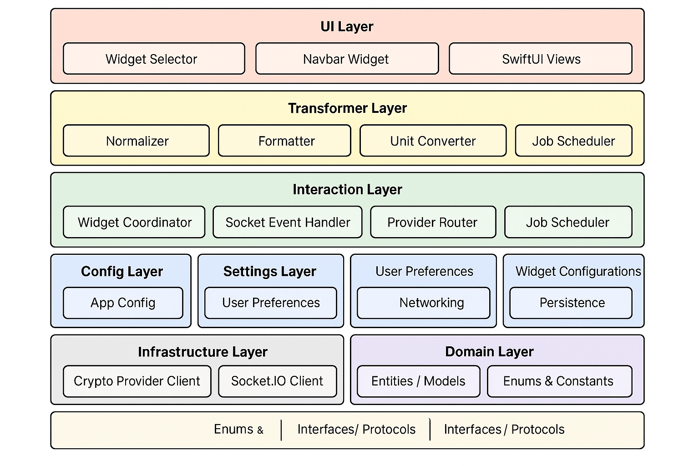

# CoinPeek 

<p align="center">
  
</p>

<p align="center">
  <strong>CoinPeek – Real-time market insights at a glance.</strong>
</p>

<p align="center">
  <em>CoinPeek is a real-time crypto widget app for macOS and iOS, delivering live prices and market insights from multiple providers in a sleek, customizable interface.</em>
</p>

---

## 🚀 CoinPeek – Crypto Widget Swift
<p align="center">
  A modular, scalable, real-time cryptocurrency widget app built with <strong>Swift</strong>, <strong>SwiftUI</strong>, and <strong>Socket.IO</strong>, designed for the macOS ecosystem.<br>
  CoinPeek allows users to select, configure, and display dynamic crypto widgets on their desktop or navbar — powered by multiple data providers.
</p>

<p align="center">
  
  
</p>

##


<p align="center">
  
  
  
  
</p>


<p align="center">
  <a href="https://github.com/amirtaherkhani/coinpeek/issues">
    
  </a>
  <a href="https://github.com/amirtaherkhani/coinpeek/pulls">
    
  </a>
  <a href="https://github.com/users/amirtaherkhani/projects/3">
    
  </a>
  <a href="https://github.com/amirtaherkhani/coinpeek/commits/main">
    
  </a>
  <a href="https://github.com/amirtaherkhani/coinpeek/blob/main/LICENSE">
    
  </a>
</p>
  
## 🧩 Architecture Overview

> The app follows a clean, layered architecture inspired by **MVVM**, **Clean Architecture**, and **modular event-driven** patterns. It is designed to be testable, extensible, and highly reusable.

---

## 🔷 Architecture Layers

### 🎨 **1. UI Layer**

> Responsible for all user interactions and SwiftUI rendering.

* `WidgetSelector`: Choose and configure desktop widgets
* `NavbarWidget`: Minimal view pinned to macOS menu bar
* `SwiftUI Views`: Reactive views bound to ViewModels

### 🔁 **2. Transformer Layer**

> Prepares raw crypto data for UI rendering.

* `Normalizer`: Converts API-specific formats into common models
* `Formatter`: Formats price, volume, date, etc.
* `UnitConverter`: Handles currency and unit conversion

### 🔄 **3. Interaction Layer**

> Orchestrates core app behavior in response to events.

* `WidgetCoordinator`: Links configured widgets to services and data
* `SocketEventHandler`: Routes socket events to handlers
* `ProviderRouter`: Dynamically selects the appropriate crypto provider
* `TaskScheduler`: Manages periodic sync and background jobs

### ⚙️ **4. Config Layer**

> Holds static or environment-based configuration.

* `AppConfig`: Loads `.plist`, `.env`, or secure configs (API URLs, themes, feature flags)

### 🔧 **5. Settings Layer**

> Manages user-specific and runtime settings.

* `UserPreferences`: Currency, refresh rate, selected provider
* `WidgetConfigurations`: Per-widget state and layout
* `Networking`: Preferences like proxy or Wi-Fi-only
* `Persistence`: Saves and loads settings using `UserDefaults`, files, or secure storage

### 🏗 **6. Infrastructure Layer**

> Handles all external I/O and system interaction.

* `CryptoProviderClient`: REST and WebSocket APIs for price data
* `Socket.IO Client`: Real-time data stream using `socket.io-client-swift`
* `Network Layer`: `URLSession` abstraction
* `Persistence`: `FileManager`, `SQLite`, `CoreData`

### 🧠 **7. Domain Layer**

> Defines business logic, data models, and protocols.

* `Entities / Models`: `CryptoAsset`, `PricePoint`, etc.
* `Enums & Constants`: Currency types, provider keys, update intervals
* `Protocols`: `CryptoProviderProtocol`, `WidgetRenderable`, etc.

> ✅ This layer is **independent** and **fully reusable** across platforms.

---

## 🔁 Data Flow Summary

```
[External Providers → Infrastructure Layer]
        ↓
[Services + Config/Settings]
        ↓
[Interaction Layer → Transformer Layer]
        ↓
[UI Layer (Widgets)]
```

---

## ✅ Key Design Principles

| Principle                 | Implementation                                                   |
| ------------------------- | ---------------------------------------------------------------- |
| **Modular**               | Each layer is replaceable, testable, and injectable              |
| **Reactive/Event-Driven** | Socket.IO + Combine / async/await                                |
| **MVVM + Clean Arch**     | Clear separation of state, view, logic, side effects             |
| **Multi-provider ready**  | `ProviderRouter` + Strategy Pattern                              |
| **Easy Extensibility**    | Add new widgets, services, or providers via protocol conformance |

---

## 🚀 Getting Started

```bash
git clone https://github.com/amirtaherkhani/coinpeek.git
cd coinpeek
open CoinPeek.xcodeproj
```

> Swift Package Manager will auto-resolve all dependencies (e.g. `socket.io-client-swift`).

---

## 📁 Folder Structure

```
CoinPeek/
├── UI/
├── Transformers/
├── Interaction/
├── Services/
├── Settings/
├── Config/
├── Infrastructure/
├── Domain/
```

---

## 🧪 Testing

* Unit tests for Domain and Services
* Snapshot tests for SwiftUI widgets
* Integration tests for data pipelines and socket events


---

## ₿ Providers Integration Roadmap

CoinPeek will support major global exchanges and selected Iranian market providers for broader accessibility.

- [ ] Binance
- [ ] Coinbase Pro
- [ ] Kraken
- [ ] KuCoin
- [ ] Bybit
- [ ] OKX
- [ ] CoinGecko
- [ ] CryptoCompare
- [ ] Nobitex (Iran)
- [x] Wallex (Iran)
- [ ] Exir (Iran)
- [ ] Bitpin (Iran)

## ROADMAP

<!-- ROADMAP:START -->
### Roadmap Snapshot
**Core phases**

| # | Title | Labels |
|---|-------|--------|

**Project Board:** https://github.com/users/amirtaherkhani/projects/3
### Roadmap Snapshot
**Core phases**

| # | Title | Labels |
|---|-------|--------|

**Project Board:** https://github.com/users/amirtaherkhani/projects/3
### Roadmap Snapshot
**Core phases**

| # | Title | Labels |
|---|-------|--------|

**Project Board:** https://github.com/users/amirtaherkhani/projects/3
### Roadmap Snapshot
**Core phases**

| # | Title | Labels |
|---|-------|--------|

**Project Board:** https://github.com/users/amirtaherkhani/projects/3
### Roadmap Snapshot
**Core phases**

| # | Title | Labels |
|---|-------|--------|

**Project Board:** https://github.com/users/amirtaherkhani/projects/3
### Roadmap Snapshot
**Core phases**

| # | Title | Labels |
|---|-------|--------|

**Project Board:** https://github.com/users/amirtaherkhani/projects/3
### Roadmap Snapshot
**Core phases**

| # | Title | Labels |
|---|-------|--------|

**Project Board:** https://github.com/users/amirtaherkhani/projects/3
<!-- This section is auto-generated. Do not edit manually. -->
<!-- ROADMAP:END -->


## 📈 Project Metrics
<div align="center">
  
</div>

**Providers:** 
[WalletX](https://github.com/amirtaherkhani/coinpeek/issues?q=is%3Aissue+label%3A%22phase%3A3a%22) ·
[Binance](https://github.com/amirtaherkhani/coinpeek/issues?q=is%3Aissue+label%3A%22phase%3A3b%22)

**By area:** 
[Core](https://github.com/amirtaherkhani/coinpeek/issues?q=is%3Aissue+label%3Aarea%3Acore) ·
[UI](https://github.com/amirtaherkhani/coinpeek/issues?q=is%3Aissue+label%3Aarea%3Aui)


## 🤝 Contributing

**MIT © 2025   GNU GENERAL PUBLIC LICENSE**

Feel free to open issues or submit PRs if you’d like to extend functionality, **`fix bugs`**, or contribute **`crypto provider integrations`**.

##

<p align="center" style="font-size:18px;">
  <strong>CoinPeek – Real-time market insights at a glance.</strong>
</p>

<p align="center">
  <a href="https://apps.apple.com/app/idYOUR_APP_ID">
    
  </a>
</p>


